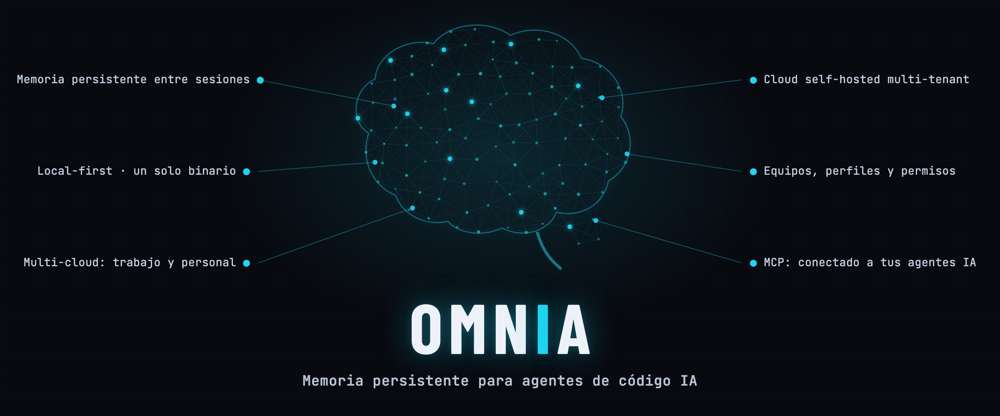
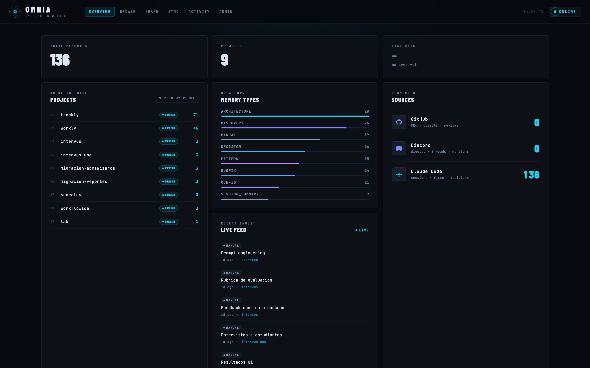
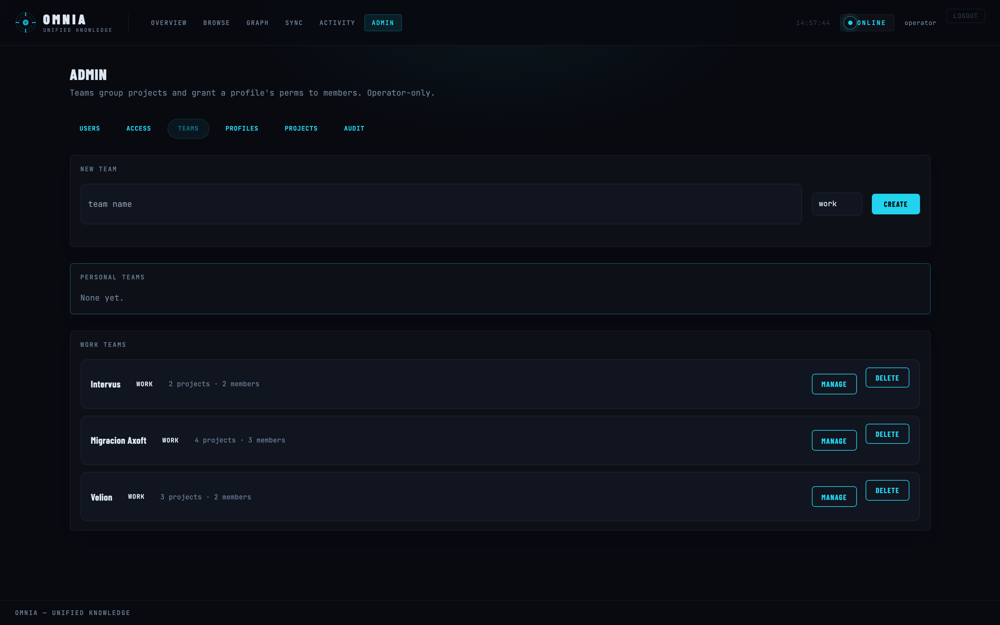
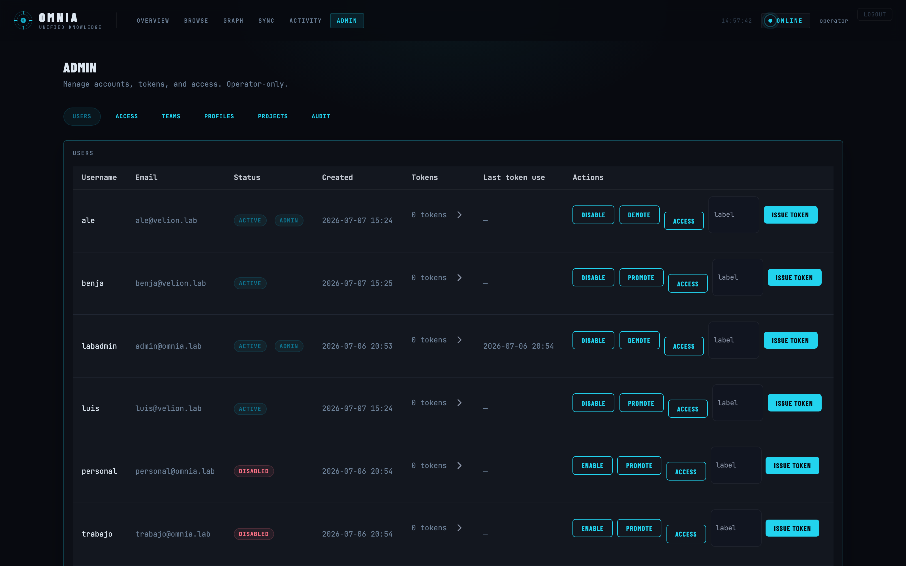

<p align="center">
  
</p>

<h1 align="center">Omnia</h1>

<p align="center">
  <strong>Persistent memory for AI coding agents</strong> — local-first, one binary, with an optional self-hosted multi-tenant cloud.
</p>

<p align="center">
  <a href="https://github.com/Velion-SpA/omnia/releases"></a>
  
  
  
</p>

---

Your AI agent forgets everything between sessions. Omnia gives it a memory that
survives — decisions, bug fixes, conventions, and context — so it stops asking
you the same questions and starts working from what your team already knows.

It's a single Go binary that stores memories in local SQLite and exposes them to
any agent over **MCP** (`mem_save`, `mem_search`, …). Turn on the optional cloud
and those memories sync across machines and teammates, with per-project access
control and an admin dashboard.

> Omnia is the evolution of **Engram** — same local-first core, now one unified
> binary and brand.

## Features

- 🧠 **Memory that persists across sessions.** `mem_save` / `mem_search` and a
  handful of companion tools, wired into Claude Code and any MCP-speaking agent
  with one command.
- 🔎 **Recall that actually finds things.** Hybrid lexical + semantic search
  (Reciprocal Rank Fusion over FTS5 and local embeddings), plus a **signature
  lane** that re-surfaces the proven fix for a recurring error — even when you
  describe it in different words.
- 💻 **Local-first, one binary.** SQLite is the source of truth. `brew install`,
  run `omnia tui`, done. No services required for solo use.
- ☁️ **Self-hosted multi-tenant cloud (optional).** Sync memories across your
  machines and team. Teams, permission profiles, per-project access, sync
  pause/resume, and an operator dashboard — all on infra you control.
- 🔌 **Ingestion connectors.** Flow company knowledge into memory from GitHub and
  Discord (Jira, Confluence and Outlook in progress), so context lands before
  anyone asks for it.
- 🔒 **Yours end to end.** No SaaS lock-in: your data lives in your SQLite file
  and, if you enable it, your own cloud.

## Screenshots

<table>
  <tr>
    <td colspan="2"><br><sub><b>Cloud dashboard</b> — overview: projects, memory-type breakdown, connected sources</sub></td>
  </tr>
  <tr>
    <td width="50%"><br><sub><b>Teams</b> — group projects and grant a profile's permissions to members</sub></td>
    <td width="50%"><br><sub><b>Users &amp; access</b> — accounts, tokens, and per-project permissions</sub></td>
  </tr>
</table>

## Install

```sh
# Homebrew (macOS / Linux)
brew install velion-spa/tap/omnia

# or with Go
go install github.com/velion/omnia/cmd/omnia@latest

# or from source
git clone https://github.com/Velion-SpA/omnia && cd omnia
go build -o bin/omnia ./cmd/omnia
```

## Quickstart

### Give your agent a memory

```sh
# Wire Omnia's memory tools into your agent (claude-code, opencode, pi, gemini-cli, codex)
omnia setup claude-code
```

That's it. Your agent can now call `mem_save`, `mem_search`, `mem_context`, and
friends. Memories are stored locally and recalled automatically across sessions.

### Browse and search from the terminal

```sh
omnia tui                 # interactive terminal UI
omnia search "auth bug"   # one-shot search
omnia save "Fixed N+1 in UserList" "wrapped the query in a JOIN" --type bugfix
```

### Run the HTTP API (for the dashboard, sync, or integrations)

```sh
omnia serve               # HTTP API on 127.0.0.1:7437
```

## Recall & semantic search

Recall fuses lexical (FTS5) and semantic (embedding) hits with Reciprocal Rank
Fusion. Embeddings run locally through [Ollama](https://ollama.com) — no data
leaves your machine.

```yaml
embeddings:
  enabled: true
  base_url: http://localhost:11434
  model: jina/jina-embeddings-v2-base-es   # ES↔EN shared space, 768-dim
recall:
  enabled: true
  strong_floor: 0.35   # jina-calibrated; the 0.65 default is tuned for other models
  base_floor: 0.25
```

Both default to **off** — disabled reproduces the FTS5-only path byte-for-byte,
so enabling them is a pure config flip with zero database migration. When
`recall.enabled` is unset and Ollama is reachable, Omnia auto-detects it.

`embeddings.model` accepts any Ollama-served embedding model — jina stays the
shipped default until an eval-gated swap is recorded. `embeddinggemma:300m`
(Google's Matryoshka-trained 300M-parameter model) is a selectable
alternative whose native dimension can be truncated at runtime via
`embeddings.dim` (`768`/`256`/`128`) instead of always using the full
dimension — non-MRL models like jina reject a truncated `dim` at config-load
time rather than silently degrading their output.

## Omnia Cloud (optional)

Omnia is local-first: your local SQLite is always the source of truth. The cloud
is optional replication/shared access, and you host it yourself.

```sh
omnia cloud config --server https://omnia.example.com
omnia cloud enroll my-project

# One-time per-project upgrade flow (doctor -> repair -> bootstrap -> status/rollback):
omnia cloud upgrade doctor --project my-project
omnia cloud upgrade repair --project my-project --apply
omnia cloud upgrade bootstrap --project my-project
omnia cloud upgrade status --project my-project

omnia cloud serve         # run the multi-tenant server + dashboard
```

The operator dashboard manages **users, teams, permission profiles, and
per-project access**, with a project view that shows each project's memories,
who can read it, sub-projects, and sync state. Access is a per-project bitfield
(read / insert / update / delete), resolved as membership overrides unioned with
team-derived profiles.

## Ingestion connectors

Pull external knowledge into memory so agents have context without being told.
Items are routed to a project and upserted (no duplicates, just revisions).

```sh
export GITHUB_TOKEN=$(gh auth token)
omnia --source github sync           # issues, PRs, discussions
omnia --source github --dry-run sync # preview without writing

export DISCORD_BOT_TOKEN=your_bot_token
omnia --source discord sync
```

> Global flags (`--source`, `--dry-run`, `--since`, `--config`) go **before** the
> subcommand: `omnia --source github sync`.

**Per-project routing.** GitHub items route to the repo name, Discord to the
guild slug, overridable via a `routes` map — so a PR from `owner/saluvita` lands
in the same `saluvita` project the agent detects when you open that repo.

```yaml
routes:
  github/owner/saluvita: saluvita
```

Every observation ends with a machine-readable `omnia-meta` block (source, kind,
project, author, URL, timestamps). See [docs/METADATA.md](docs/METADATA.md).

## Config reference

Config lives at `~/.config/omnia/config.yaml` (`cp config.example.yaml` to start).

| Key | Default | Description |
|-----|---------|-------------|
| `engram.base_url` | `http://127.0.0.1:7437` | Local daemon URL (section name kept for compatibility) |
| `engram.default_project` | `omnia` | Last-resort project fallback |
| `routes` | `{}` | Per-origin project routing map |
| `sources.github.enabled` | `false` | Enable GitHub ingestion |
| `sources.github.repos` | `[]` | List of `owner/repo` strings |
| `sources.discord.enabled` | `false` | Enable Discord ingestion |
| `backfill_days` | `30` | Days to look back on first run |
| `embeddings.enabled` | `false` | Enable the local semantic index |
| `embeddings.model` | `jina/jina-embeddings-v2-base-es` | Embedding model (also `bge-m3`, `embeddinggemma:300m` — MRL-capable) |
| `embeddings.dim` | `768` | Effective embedding dimension; MRL-capable models (`embeddinggemma:300m`) may set this below their native output (`256`/`128`) to truncate + re-normalize — rejected for non-MRL models |
| `recall.enabled` | `false` | Enable hybrid lexical+semantic recall for `mem_search` |
| `recall.strong_floor` / `recall.base_floor` | `0.65` / `0.55` | Cosine relevance floors (tune to ~`0.35`/`0.25` for jina) |
| `recall.ranking.enabled` | `false` | Enable the recency × importance × relevance re-ranking pass over `mem_search`/`omnia search` output (byte-for-byte identical to today's order when off) |
| `recall.ranking.weights.recency` / `.importance` / `.relevance` | `1.0` / `1.0` / `1.0` | Per-component multipliers in the weighted-sum ranking score |
| `recall.ranking.recency_half_life_days` | `14` | Days until the recency component decays to `0.5`; never reaches `0`, so recency alone can never exclude a result |
| `injection.budget.enabled` | `false` | Enable `mem_search`'s token-based injection budget (top-ranked results kept complete, in order, until the next one would exceed the budget — no partial truncation; byte-for-byte identical output when off) |
| `injection.budget.max_tokens` | `1500` | Estimated-token ceiling for `injection.budget`; the topic_key exact-match sentinel and error-signature-match rows are always emitted complete and never count against this budget |
| `injection.context_budget.enabled` | `false` | Enable `FormatContext`'s (mem_context / `omnia context` / dashboard) aggregate token budget across its pinned/recent-observations/recent-sessions/recent-prompts buckets — fixes a pre-existing defect where each bucket was individually per-item truncated but never capped in total; byte-for-byte identical (today's uncapped) output when off |
| `injection.context_budget.max_tokens` | `1500` | Estimated-token ceiling for `injection.context_budget`, consumed pinned-first (never starved), then recent observations, then recent sessions, then recent prompts last |
| `injection.diversity.enabled` | `false` | Enable an MMR (maximal marginal relevance) read-time diversity pass over `mem_search` results: demotes/hard-drops rows near-duplicating an already-selected higher-ranked row using a cheap token-set Jaccard similarity over hydrated content (no new embedding calls, no new model dependency); byte-for-byte identical output when off |
| `injection.diversity.lambda` | `0.7` | Relevance-vs-diversity balance in the greedy MMR reselection `argmax[lambda*rel(d) - (1-lambda)*maxSim(d, selected)]`; higher favors relevance, lower favors diversity |
| `injection.diversity.similarity_threshold` | `0.9` | Jaccard similarity hard-drop cutoff; a candidate whose similarity to an already-selected row meets or exceeds this is dropped entirely as a near-duplicate, not merely reordered |

Cloud env vars use the `OMNIA_CLOUD_*` prefix (legacy `ENGRAM_CLOUD_*` also accepted).

## Architecture

```
cmd/omnia/          CLI (serve, mcp, tui, search, save, recall-fix, cloud, sync, setup…)
internal/store/     SQLite memory store + FTS5
internal/recall/    Hybrid lexical+semantic fusion (RRF) + signature lane
internal/embed/     Local embeddings (Ollama) + vector store
internal/mcp/       MCP server — the mem_* tools agents call
internal/cloud/     Multi-tenant server, cloudstore, and the admin dashboard
internal/ui/        Shared "Command Center" design system (templ + one CSS)
internal/source/    Ingestion adapters (github, discord)
```

## Scheduled ingestion (macOS)

```sh
cp deploy/com.velion.omnia.plist ~/Library/LaunchAgents/
# replace the token placeholders in the plist, then:
launchctl load ~/Library/LaunchAgents/com.velion.omnia.plist
```

Runs `omnia sync` nightly. If a run fails, sync cursors are not advanced, so the
next run safely re-fetches and re-upserts the same window.

## License

MIT © Velion SpA
