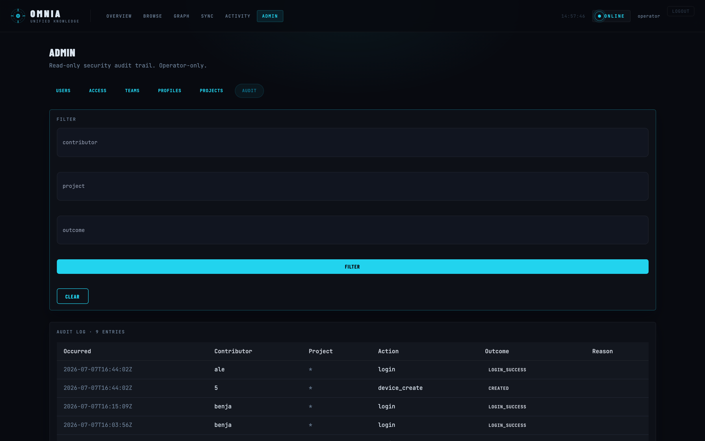

<p align="center">
  
</p>

# Omnia

Omnia es memoria persistente para agentes de codificación con IA: local-first, un solo binario, con sincronización cloud multi-tenant self-hosted opcional. Se ejecuta como un daemon local (HTTP + MCP) en el que los agentes guardan observaciones y contra el que realizan búsquedas, de modo que el contexto persiste entre sesiones y compactaciones en lugar de tener que volver a explicarse cada vez.

Consulte [DOCS.md](DOCS.md) para la referencia técnica completa (esquema de la base de datos, API HTTP, herramientas MCP, funcionamiento interno de cloud sync).

## Dashboard Cloud

La nube self-hosted incluye un dashboard tipo centro de comando: cada cuenta ve únicamente los proyectos que sus equipos le otorgan, y los administradores gestionan usuarios, equipos, perfiles y permisos por proyecto desde la pantalla.

**Vista general** — proyectos, desglose por tipo de memoria y un feed en vivo de observaciones entrantes:


**Equipos** — agrupa proyectos y asigna los permisos de un perfil (Moderator / Editor / Member) a los miembros:


**Usuarios y accesos** — gestiona cuentas, anulaciones por proyecto (R/W/U/D) y tokens vinculados a dispositivos:


**Auditoría** — cada acción administrativa y de sincronización queda registrada:



## Instalación

### Homebrew (macOS/Linux)

```sh
brew tap velion-spa/tap
brew install omnia
```

### curl | sh (Linux)

```sh
curl -fsSL https://raw.githubusercontent.com/Velion-SpA/omnia/main/scripts/install.sh | sh
```

Detecta el sistema operativo y la arquitectura, descarga el release correspondiente desde [GitHub Releases](https://github.com/Velion-SpA/omnia/releases), verifica su checksum, y lo instala en `~/.local/bin` (o en `/usr/local/bin` con `sudo` si se ejecuta como root).

### go install

```sh
go install github.com/Velion-SpA/omnia/cmd/omnia@latest
```

### Inicio rápido

```sh
omnia cloud add <alias> --server https://your-cloud-server
omnia cloud login
omnia sync
```

`omnia setup` guía la configuración inicial (integración con el agente, directorio de datos) de forma interactiva.

## Ingesta de conocimiento (fuentes externas)

Este repositorio también incluye paquetes adaptadores de fuente (`internal/core`, `internal/source/discord`,
`internal/source/github`, `internal/sink/engram`, `internal/config`, `internal/state`,
`internal/enrich`) para un ingestor complementario que sincroniza actividad de Discord/GitHub hacia la memoria.
Las secciones siguientes describen la superficie de CLI original de ese ingestor: es anterior al binario
actual `cmd/omnia` y, por el momento, no está integrado en él — los comandos que siguen deben considerarse
aspiracionales/legacy hasta su reintegración. Consulte `internal/source/*` para el código subyacente.

### Sincronizar GitHub

> **Nota:** Las flags globales (`--source`, `--dry-run`, `--since`, `--config`) deben ir
> **antes** del subcomando, por ejemplo `omnia --source github sync`.
> Las flags ubicadas después del subcomando se interpretan como argumentos y se ignoran silenciosamente.

```sh
# Uses GITHUB_TOKEN env var, or gh auth token fallback
export GITHUB_TOKEN=$(gh auth token)
omnia --source github sync

# Dry run (preview without writing)
omnia --source github --dry-run sync

# Sync only issues updated in the last 7 days
omnia --source github --since $(date -u -v-7d +%Y-%m-%dT%H:%M:%SZ) sync
```

**Nota sobre la sincronización incremental:** Después de la primera ejecución, los cursores por repositorio
se almacenan en `~/.local/state/omnia/state.json`. En cada ejecución posterior, omnia lee estos cursores
y pasa el timestamp `updated_at` más reciente a la API de GitHub como parámetro `since`, de modo que solo
se obtienen los elementos actualizados después de la última sincronización. El cursor solo avanza una vez
que todas las escrituras al sink tienen éxito — si una escritura falla, omnia finaliza con código distinto
de cero y **no** avanza el cursor. Volver a ejecutarlo es seguro porque Engram hace upsert sobre
`topic_key+project` (sin duplicados, solo un incremento de revisión).

### Sincronizar Discord

```sh
export DISCORD_BOT_TOKEN=your_bot_token
omnia --source discord sync
```

### Verificar estado

```sh
omnia status
```

## Enrutamiento por proyecto

De forma predeterminada, Omnia enruta los elementos de GitHub al nombre del repositorio (sin el owner) como
proyecto de Engram, y los elementos de Discord al slug del guild. Esto puede sobrescribirse con el mapa `routes`:

```yaml
routes:
  github/arratiabenjamin/saluvita: saluvita   # explicit override
  # discord/123456789: saluvita
```

Orden de resolución por elemento: mapa `routes` → derivación por defecto (nombre del repo / slug del guild) →
`engram.default_project`. Los nombres de proyecto se normalizan a minúsculas. Esto significa que un PR de
`arratiabenjamin/saluvita` termina en el proyecto `saluvita` — el mismo proyecto que Engram detecta cuando
un desarrollador abre ese repositorio en Claude Code.

## Metadatos estructurados (omnia-meta)

Cada observación que Omnia escribe finaliza con un bloque `omnia-meta` delimitado que contiene metadatos
estructurados: source, kind, project, author, participants, URL, timestamps y datos del chunk. El bloque
está pensado para ser leído por máquinas y se agrega a cada chunk para que cada uno pueda analizarse de
forma independiente. Es la base para el futuro índice de Omnia (vector search + filtros estructurados).

Consulte [docs/METADATA.md](docs/METADATA.md) para la referencia completa de campos y la política de versionado.

## Referencia de configuración

| Clave | Predeterminado | Descripción |
|-----|---------|-------------|
| `engram.base_url` | `http://127.0.0.1:7437` | URL del daemon de Engram |
| `engram.default_project` | `omnia` | Proyecto de Engram predeterminado (fallback de último recurso) |
| `routes` | `{}` | Mapa de enrutamiento de proyecto por origen |
| `sources.github.enabled` | `false` | Habilita la ingesta de GitHub |
| `sources.github.repos` | `[]` | Lista de strings `owner/repo` |
| `sources.discord.enabled` | `false` | Habilita la ingesta de Discord |
| `sources.discord.channels` | `[]` | Lista de `{id, name, guild}` |
| `backfill_days` | `30` | Días hacia atrás a considerar en la primera ejecución |

## Omnia Cloud (opcional)

Omnia es local-first: el SQLite local es la fuente de verdad; las funciones cloud son replicación/acceso
compartido opcional.

Para configurar la replicación cloud:

```bash
omnia cloud config --server http://127.0.0.1:18080
omnia cloud enroll smoke-project
omnia cloud upgrade doctor --project smoke-project
omnia cloud upgrade repair --project smoke-project --dry-run
omnia cloud upgrade repair --project smoke-project --apply
omnia cloud upgrade bootstrap --project smoke-project
omnia cloud upgrade status --project smoke-project
omnia cloud serve
```

Variables de entorno de cloud: `ENGRAM_CLOUD_TOKEN` (bearer token), `ENGRAM_JWT_SECRET` (requerido en modo
auth), `ENGRAM_CLOUD_ADMIN` (token de admin opcional).
Rutas del dashboard: `/dashboard/login`, `/dashboard/contributors`.

## Arquitectura

```
cmd/omnia/           CLI (sync, status)
internal/core/       Domain model + ports + pipeline
internal/config/     YAML config loader
internal/state/      Cursor persistence (JSON)
internal/enrich/     Normalization, chunking, keywords
internal/source/     Source adapters (github, discord)
internal/sink/       Sink adapters (engram)
```

## Agregar una nueva fuente

1. Crear `internal/source/<name>/<name>.go`
2. Implementar la interfaz `core.Source` (`Name() string`, `Fetch(ctx, since) ([]Item, error)`)
3. Conectarlo en `cmd/omnia/main.go`, dentro de `runSync`
4. Agregar los campos de configuración a `internal/config/config.go`

Consulte `docs/WHATSAPP.md` y `docs/JIRA.md` para los planes de fuentes en progreso.

## Ejecuciones programadas (macOS)

Copie y edite el plist de launchd:

```sh
# 1. Build and install the binary first
go build -o /usr/local/bin/omnia ./cmd/omnia

# 2. Copy the plist and replace the token placeholders
cp deploy/com.velion.omnia.plist ~/Library/LaunchAgents/
# Open the plist and replace REPLACE_WITH_YOUR_GITHUB_TOKEN and
# REPLACE_WITH_YOUR_DISCORD_BOT_TOKEN with real values before loading.

# 3. Load the agent
launchctl load ~/Library/LaunchAgents/com.velion.omnia.plist
```

Esto ejecuta `omnia sync` todas las noches a las 2am.

**Comportamiento ante fallos:** Si omnia finaliza con un código distinto de cero (por ejemplo, si Engram
no está disponible o una escritura falla), los cursores de estado no avanzan. La siguiente ejecución
programada volverá a obtener la misma ventana e intentará escribir nuevamente. Como Engram hace upsert
por `topic_key+project`, volver a ingerir los mismos elementos siempre es seguro.
